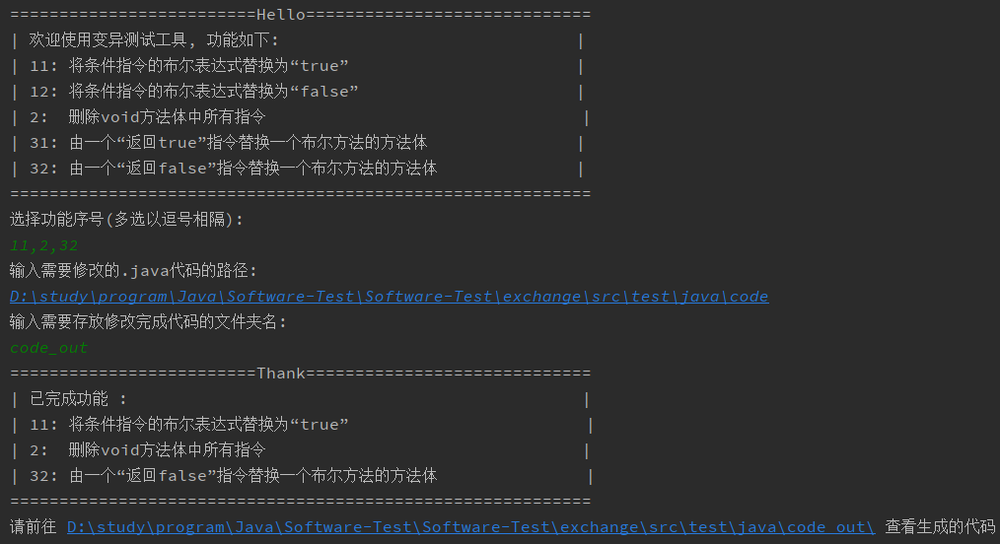
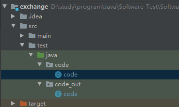
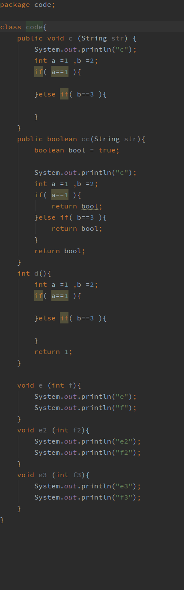
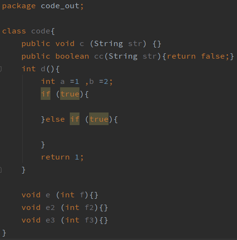

# Software-Test

  软件测试实验

## 变异测试

### 实验目的及要求

突变测试是一种评估测试套件质量的技术。如果一个测试套件能够检测出bug，那么它就是好的。突变测试背后的想法是创建原始程序的修改版本，或者通过插入人工bug来创建突变体，然后检查测试套件是否能够检测这些更改。一个变体可以很简单，例如，在算术表达式上下文中用+替换-。其他的例子可能是用“false”替换条件指令中的布尔表达式，或者用某个值替换方法调用。每一种类型的转换通常被称为变异操作符。给定相同的代码，一个突变操作符可以创建一个或多个突变。您的任务是创建一个工具，在给定的Java项目上执行突变测试。

您的工具应该包含以下突变操作符:

1. 将条件指令的布尔表达式替换为“false”，然后替换为“true”。
2. 删除void方法体中所有指令
3. 由一个“返回true”(或“返回false”)指令替换一个布尔方法的方法体。

### 图片演示

#### 输入操作

#### 代码存放

#### 原始代码

#### 修改后的代码

